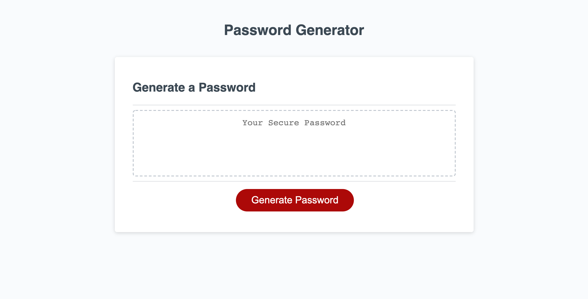
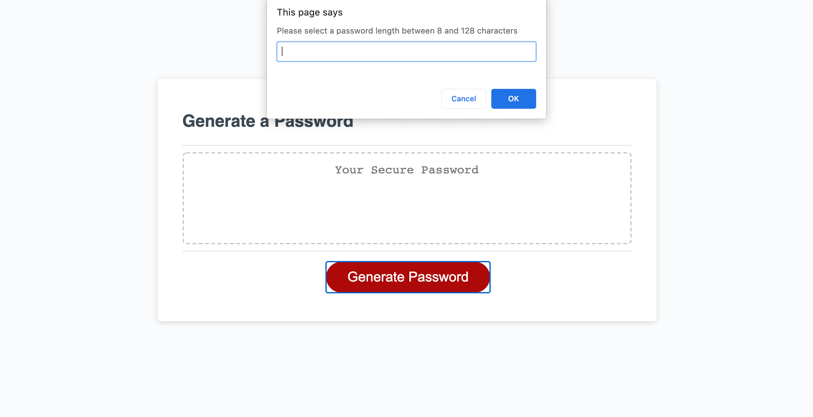
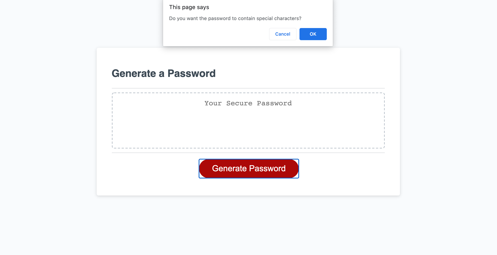
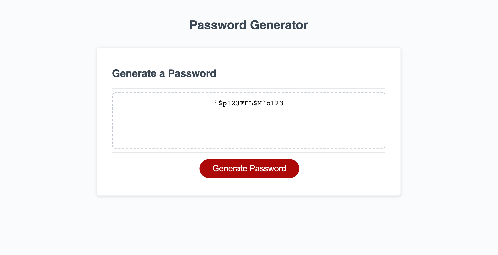

# Password Generator

## Description

Easy to use application that allows users to generate a random password based off of criteria they've input. Users can select a length between 8 and 128 characters for the password and include whether they would like the password to contain lowercase letters, uppercase letters, numbers, and/or special characters.

## Installation

This application runs in the browser through dynamically updated HTML and CSS that is powered by Javascript.

## Views

### Landing Page

### User selection of password length

### Prompt for one of the character types

### Resulting random password generated

## Link to Deployed Application

[password-generator](https://smserpa.github.io/password-generator/)

